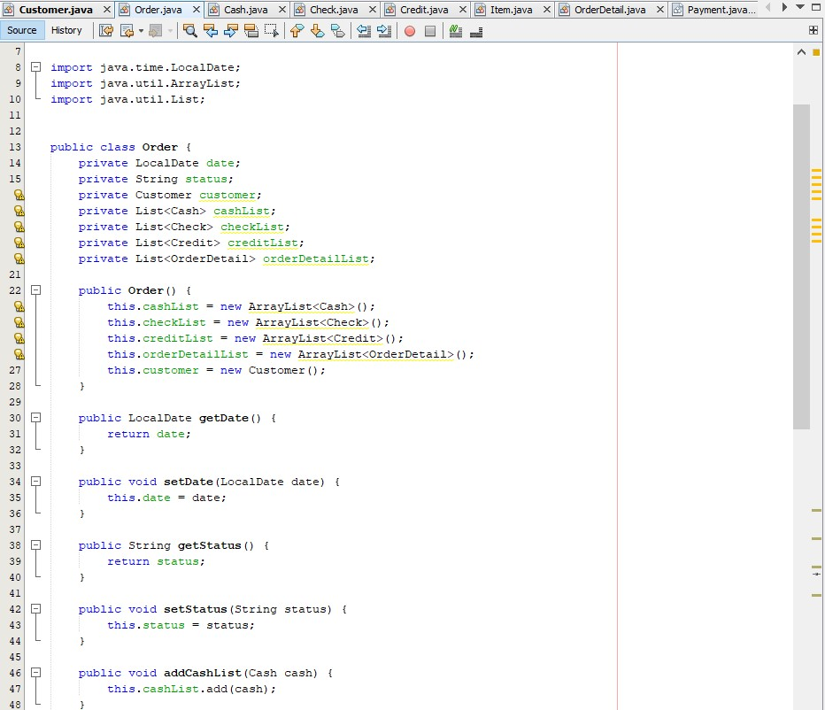

# Laporan-Praktikum-8

## Nama : Imam Solehudin
## Nim : 312110290
## Kelas : TI.21.C.1
## Matkul : Pemrograman Berorientasi Objek

1. Program Customer

2. Program Order

3. Program Order Detail

4. Program Item

5. Program Payment

6. Program Cash

![gambar]Screenshot/Cash.jpg)

7. Program Check

8. Program Credit

9. Program Main

10. Hasil Program

